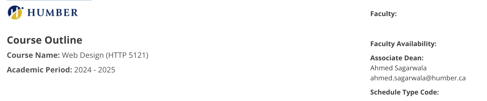

# HTTP 5121

## Learning Outcomes
Build a website using current versions of HTML.
Use current versions of CSS to apply design to a website.
Implement responsive principles using Cascading Style Sheets (CSS).

This is a link to the class : [http5121](https://humber.ca/transferoptions/course-outlines/outline.html?code=HTTP%205121&view=1&year=2024)

## Code Sample
<body>

This is a paragraph. <strong>This is bolded text while <em>this
is bolded and italicized.</em></strong>

</body>

>[!Note]
> Professor Joanna Kommala makes learning enjoyable with their fun approach and is incredibly patient, ensuring every student feels supported!